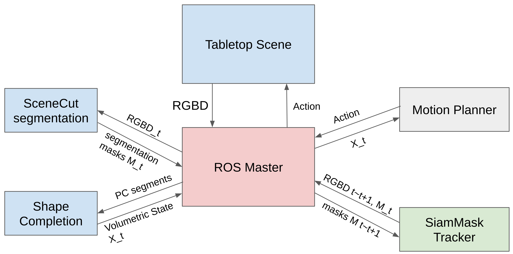

# Multihypothesis Segmentation Tracking

This is the public code release for the Multihypothesis Segmentation Tracking algorithm.
Documentation and dependency cleanup is still a work in progress, but please create an issue if you're interesting in using the code and encounter difficulty.

## Related Repositories

* [SceneCut Segmentation](https://github.com/UM-ARM-Lab/scenecut-segmentation)
* [Shape Completion](https://github.com/UM-ARM-Lab/mps_shape_completion)
* [SiamMask Tracker](https://github.com/UM-ARM-Lab/SiamMask)

## Project Structure



## Prerequisites

* Linux
* ROS
* OpenCV
* PCL
* Octomap

## Demo

### Download and Compile

```bash
cd ~/PATH_TO_LOCAL_ROS_WS/src
git clone git@github.com:UM-ARM-Lab/multihypothesis_segmentation_tracking.git
cd ../ & catkin_make
```

### Run MCMC Segmentation Sampler on stored example SceneCut output

```bash
roscore
rosrun mps_voxels demo_seg_sample
```

### Run Hypotheses Merger on stored tracking and measurements

Start up a ROS core and open up RViz so you can see the merging results.

```bash
roscore
rosrun mps_voxels demo_resample
```
